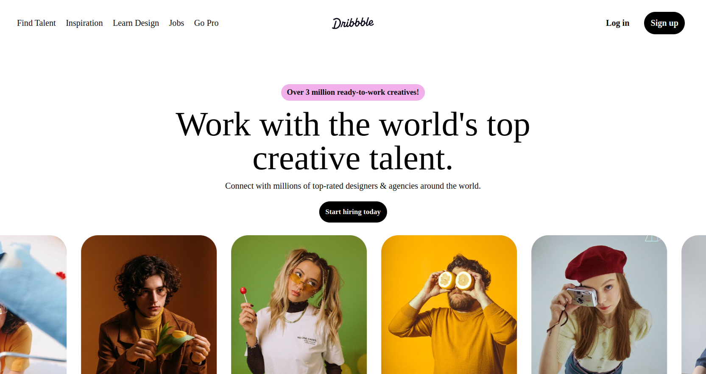
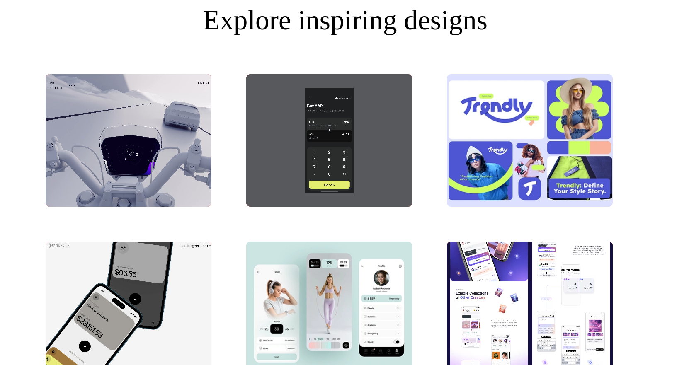
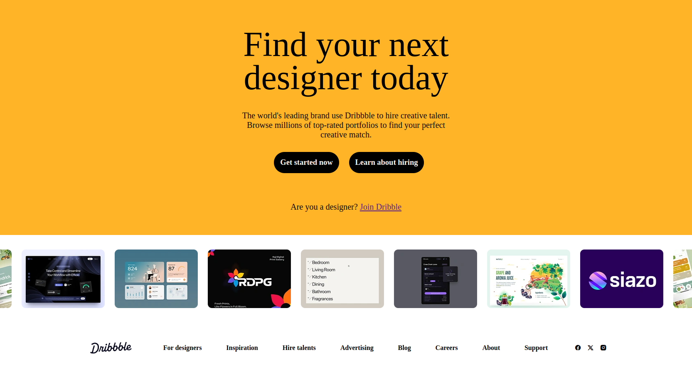

# 🎨 Dribbble Webpage Clone

> A sleek and modern recreation of the Dribbble interface, showcasing design portfolios with style and functionality.

 
 
  
 

  
  
  

---

## ✨ **What's This All About?**

This project is my take on recreating the iconic Dribbble website interface. It's designed to showcase creative portfolios with a clean, modern aesthetic that captures the essence of what makes Dribbble so visually appealing.

### 🚀 **Current Status**
- ✅ **Desktop Experience**: Fully functional and polished
- 🔧 **Mobile Responsiveness**: Currently being optimized
- 🎯 **Core Features**: Working seamlessly

---

## 🖥️ **Preview**

*Clean, modern interface optimized for desktop viewing*

---

## 🛠️ **Built With**

- **HTML5** - Semantic structure
- **CSS3** - Modern styling & animations
- **Responsive Design** - Mobile-first approach *(in progress)*

### Requirements
- Modern web browser (Chrome, Firefox, Safari, Edge)
- No additional dependencies required!

## 🎯 **Features**

### ✅ **Currently Available**
- **Portfolio Grid Layout** - Beautiful showcase of design work
- **Smooth Animations** - Engaging hover effects and transitions
- **Navigation System** - Clean and intuitive menu structure

### 🔮 **Coming Soon**
- **Mobile Optimization** - Perfect mobile experience
- **Touch Gestures** - Mobile-friendly interactions
- **Performance Enhancements** - Faster loading times
- **Additional Filters** - More ways to browse content

## 📄 **License**

This project is licensed under the MIT License - see the [LICENSE](LICENSE) file for details.

**⭐ Star this repo if you found it helpful!**

Made with ❤️ and lots of ☕

---
---